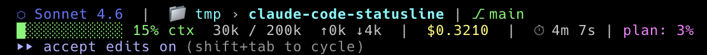

# claude-code-statusline

A two-line status bar for [Claude Code](https://github.com/anthropics/claude-code) that shows model, working directory, git branch, context usage, cost, session time, and plan rate-limit usage — all at a glance.

## Preview



**Line 1** — model · working directory · git branch + staged/modified counts · last tool + file · task progress
**Line 2** — context bar · % used · token counts · session cost · elapsed time · plan usage (with reset countdown) · weekly usage

## Requirements

- Claude Code (any recent version with `statusLine` support)
- `jq` — for parsing the JSON input Claude Code passes to the script
- `git` — for branch info (already on your system)
- A terminal with 256-color / ANSI color support

Install `jq` if needed:

```bash
# macOS
brew install jq

# Debian/Ubuntu
sudo apt install jq
```

## Installation

### Automatic (recommended)

```bash
git clone https://github.com/jspanos/claude-code-statusline.git
cd claude-code-statusline
./install.sh
```

The script copies `statusline.sh` to `~/.claude/` and adds (or merges) the `statusLine` key into `~/.claude/settings.json`. Then restart Claude Code.

### Manual

1. **Copy the script** to your Claude Code config directory:

   ```bash
   cp statusline.sh ~/.claude/statusline.sh
   chmod +x ~/.claude/statusline.sh
   ```

2. **Add the `statusLine` block** to your `~/.claude/settings.json`:

   ```json
   {
     "statusLine": {
       "type": "command",
       "command": "~/.claude/statusline.sh",
       "padding": 0
     }
   }
   ```

3. **Restart Claude Code** — the status bar appears immediately at the bottom of the session.

## What each field shows

| Field | Description |
|---|---|
| `⬡ Model` | The active Claude model name |
| `📁 project › cwd` | Project root and current subdirectory (collapsed when identical) |
| `⎇ branch` | Current git branch, `+N` staged, `~N` modified |
| Context bar | 12-char block bar (green → yellow → red as context fills) |
| `% ctx` | Percentage of context window used |
| `Xk / Yk` | Tokens used vs total context window size |
| `↑ ↓` | Input / output token totals for the session |
| `$X.XXXX` | Estimated session cost in USD |
| `⏱ Xm Xs` | Total session wall-clock time |
| `🔧 Tool file` | Last tool used and target file (parsed from session transcript) |
| `📋 done/total` | Task progress — completed vs total tasks, with current task name |
| `plan: X% (Xh Xm)` | 5-hour rate limit usage; reset countdown shown when ≥ 50% |
| `weekly: X% (Xd Xh)` | 7-day rate limit usage; only shown when ≥ 80% |

## Sending metrics to an OTLP receiver (optional)

Every status-line refresh can also push session metrics to any OTLP/HTTP endpoint
(e.g. [OtelHub](https://github.com/your/otelhub), Grafana Agent, OTel Collector).
Set two env vars and the emission happens in the background — nothing blocks
the status line rendering.

```bash
export OTELHUB_URL=http://localhost:8000        # receiver base URL
export OTELHUB_TOKEN=otlh_xxx                   # bearer token
```

`OTEL_EXPORTER_OTLP_ENDPOINT` is honored as a fallback for `OTELHUB_URL`.
Leave both vars unset to disable emission entirely — CSV logging is unaffected.

### Metrics emitted

All emitted as gauges, one data point per status-line refresh:

| Metric | Unit |
|---|---|
| `claude.context.used_percentage` | % |
| `claude.context.used_tokens` | tokens |
| `claude.context.window_size` | tokens |
| `claude.tokens.input` / `.output` | tokens |
| `claude.tokens.cache_read` / `.cache_write` | tokens |
| `claude.cost.usd` | USD |
| `claude.duration.total_ms` / `.api_ms` | ms |
| `claude.rate_limit.5h_pct` / `.7d_pct` | % (when available) |

### Resource attributes

Each payload carries these resource-level attributes so you can slice by session,
model, or project in your backend:

- `service.name` = `claude-code`
- `session.id`
- `claude.model`
- `claude.project`

## Customization

The script is a single self-contained Bash file — every section is clearly labeled with comments. Common tweaks:

- **Bar width** — change `BAR_WIDTH=12` to any integer
- **Color thresholds** — adjust the `PCT -ge 90` / `PCT -ge 70` conditionals
- **Remove a field** — delete or comment out the relevant `echo` segment at the bottom

## License

MIT
